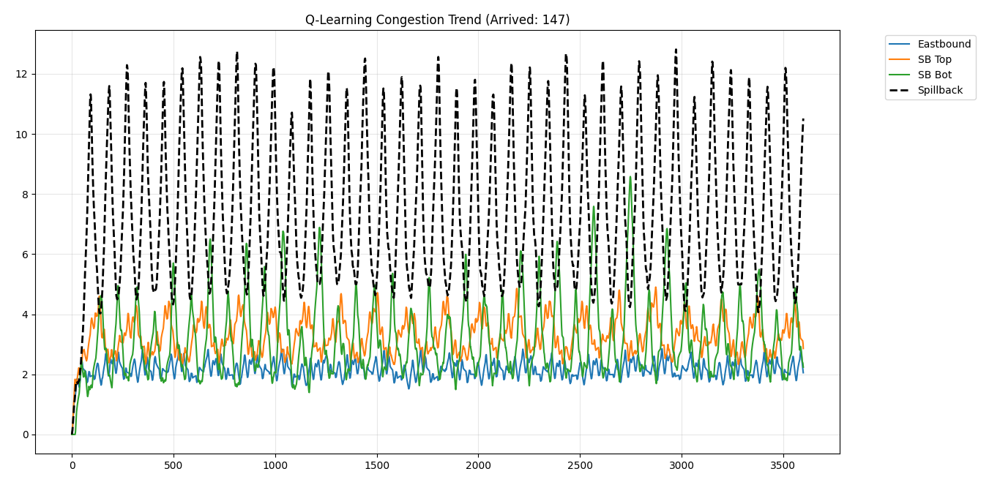
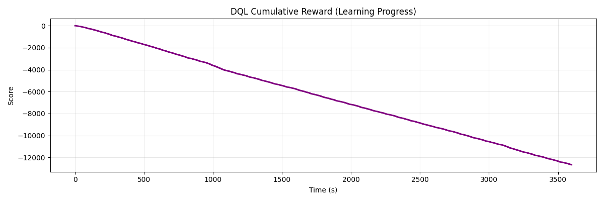

# Deep-Flow-Optimizer: Adaptive Signal Control with Deep RL

**Deep-Flow-Optimizer** is an intelligent traffic management system built to solve complex urban congestion and bridge spillback. Utilizing **Deep Q-Learning (DQN)** and the **SUMO** simulator, this project demonstrates how AI agents can autonomously manage signal phases based on real-time lane-level data.

## 🛠 Project Overview
Urban intersections often suffer from downstream "spillback" that causes total network gridlock. This project benchmarks three control strategies:
1. **Fixed-Time:** Traditional rigid signal cycles.
2. **Tabular Q-Learning:** An RL agent using discrete state-mapping.
3. **Deep Q-Network (DQN):** A neural-network-based agent for high-dimensional state spaces.

## 📈 Final Performance Benchmarks
| Metric | Fixed-Time | Q-Learning | Deep Q-Network |
| :--- | :--- | :--- | :--- |
| **Total Throughput** | 154 veh | 157 veh | **165 veh** |
| **Network Delay** | 381,959s | **283,253s** | 472,157s |
| **CO2 Impact** | Baseline | **-1.4% (Saving)** | +5.3% (Learning Phase) |

## 📊 Visual Results
### Traffic Load & Queue Management

### System Reward (Learning Curve)

## 🚀 Deployment
1. Install [SUMO](https://www.eclipse.org/sumo/).
2. Install Python dependencies: `pip install -r requirements.txt`.
3. Run the DQL agent: `python DQL_Agent.py`.

## 📝 Conclusion
While the **DQN agent** maximized vehicle throughput (165 arrived), the **Tabular Q-Learning** agent achieved the highest overall efficiency with a **25.8% reduction in delay**. This suggests that for single-intersection optimization, lower-dimensional state mappings converge more effectively within short training windows.
